# Spesifikasi & Integrasi Sensor dan Aktuator ESP32
=========================================================

Dokumen ini mendefinisikan spesifikasi teknis, skema pengkabelan (*wiring*), konfigurasi pin GPIO, dan logika kendali untuk sensor dan aktuator yang terhubung langsung ke mikrokontroler **ESP32** pada robot **NEXUS Person Follower**.

---

## 1. Ringkasan Komponen Hardware

| Kategori | Nama Komponen | Spesifikasi Utama | Antarmuka ke ESP32 |
| :--- | :--- | :--- | :--- |
| **Sensor Jarak** | **TOF400C-VL53L1X** | Jarak ukur hingga 400 cm (4 meter), laser 940nm VCSEL ToF, akurasi milimeter | I2C (SDA, SCL, 3.3V, 400 kHz) |
| **Motor Penggerak** | **PG36 Planetary Geared Motor 555** | Tegangan nominal 24V DC, *High Torque*, kecepatan nominal **222 RPM**, girboks *planetary* tahan aus | 2 Terminal Motor DC (+ / -) |
| **Sensor Kecepatan** | **Magnetic Hall Effect Encoder** | 2-Fase (*Quadrature Encoder* Fase A & B) terpasang di poros belakang motor PG36 | GPIO External Interrupt (3.3V) |
| **Driver Motor** | **BTS7960 (Dual H-Bridge 43A)** | Tegangan input daya 6V - 27V, arus puncak 43A, kontrol arah independen & proteksi arus/panas | PWM (RPWM, LPWM) & Enable (R_EN, L_EN) |

---

## 2. Diagram Arsitektur Daya & Sinyal

```
┌────────────────────────────────────────────────────────┐
│            SUMBER DAYA UTAMA: BATERAI 24V              │
└──────────────────────────┬─────────────────────────────┘
                           │
             ┌─────────────┴─────────────┐
             ▼                           ▼
   ┌───────────────────┐       ┌───────────────────┐
   │ BUCK CONVERTER    │       │ DRIVER BTS7960    │
   │ 24V -> 5V (Step   │       │ VCC Power: 24V    │
   │      Down)        │       └─────────┬─────────┘
   └─────────┬─────────┘                 │
             │ 5V                        │ 24V PWM
             ▼                           ▼
   ┌───────────────────┐       ┌───────────────────┐
   │   ESP32 (Vin/5V)  │       │ 2x MOTOR PG36     │
   │ 3.3V Logic Level  │       │ 24V 222 RPM       │
   └───────┬───┬───────┘       └─────────┬─────────┘
           │   │                         │
      I2C  │   │ PWM / Interrupt         │ Pulsa Feedback
           ▼   └─────────────────────────┴───────────────┐
   ┌───────────────┐                             ┌───────┴───────┐
   │   TOF400C     │                             │ HALL ENCODER  │
   │   VL53L1X     │                             │ (2-Phase A/B) │
   └───────────────┘                             └───────────────┘
```

> **PERINGATAN KELISTRIKAN**:
> 1. Motor PG36 membutuhkan suplai **24V**. Jangan menyuplai 24V langsung ke pin ESP32!
> 2. Semua Ground (**GND Baterai 24V, GND Buck Converter, GND ESP32, dan GND Driver BTS7960**) wajib **dihubungkan bersama (*Common Ground*)**.

---

## 3. Rincian Sensor: TOF400C-VL53L1X

Sensor **TOF400C** menggunakan chip STMicroelectronics VL53L1X berbasis teknologi *FlightSense* (pengukuran waktu tempuh foton laser cahaya), sehingga kebal terhadap pantulan warna baju atau kondisi tekstur target.

### Pinout Sensor TOF400C ke ESP32:
| Pin TOF400C | Pin ESP32 | Keterangan |
| :---: | :---: | :--- |
| **VCC** | **3V3** | Tegangan kerja sensor (3.3V aman) |
| **GND** | **GND** | Ground bersama |
| **SDA** | **GPIO 8** | Data bus I2C (Hardware I2C standar ESP32-S3) |
| **SCL** | **GPIO 9** | Clock bus I2C (Hardware I2C standar ESP32-S3) |
| **XSHUT** | **3V3 (Tarik ke 3.3V)** | Jangan hubungkan ke GPIO 19 (GPIO 19 adalah USB D- pada S3) |

### Konfigurasi Jarak & Histeresis Keamanan:
Sensor membaca jarak target ($D$) secara real-time pada **Core 0**:
* **Batas Bahaya / Hard Brake ($D \le 50\text{ cm}$)**: Pengereman darurat instan diaktifkan (`isEmergencyBrake = TRUE`).
* **Batas Pelepasan Rem ($D \ge 65\text{ cm}$)**: Rem darurat dilepas kembali (`isEmergencyBrake = FALSE`).
* **Zona Jaga Jarak Ideal ($80\text{ cm} \le D \le 120\text{ cm}$)**: Kecepatan linier $v = 0$ (robot menahan posisi / *hold position*).
* **Zona Mengikuti ($D > 120\text{ cm}$)**: Kecepatan maju $v$ bertambah secara proporsional mendekati target hingga batas aman maksimum.

---

## 4. Rincian Aktuator: Motor PG36 24V 222 RPM

Motor DC seri 555 dengan girboks *planetary* **PG36** dipilih karena memiliki rasio torsi-terhadap-ukuran yang sangat tinggi serta ketahanan *backlash* yang presisi untuk robot mobile berbeban.

### Spesifikasi Kunci:
* **Tegangan Kerja**: 24V DC.
* **Kecepatan Tanpa Beban**: ~222 RPM (pada 24V).
* **Encoder**: Hall Effect Quadrature Encoder (2 channel, Fase A & Fase B beda fase 90°).
* **Resolusi Encoder**: 11 Pulsa Per Putaran (PPR) pada poros motor primer.
* **Kompensasi Zona Mati (*Deadband Compensation*)**:
  Girboks *planetary* memiliki resistansi gesek mekanis awal (*stiction*). Pada sinyal PWM rendah ($< 35$), motor tidak berputar tetapi hanya mendengung. Firmware ESP32 mengompensasi hal ini dengan menambahkan offset PWM minimum ($\pm 35$) ke output PID setiap kali ada target kecepatan non-nol.

---

## 5. Rincian Driver Motor: BTS7960 (43A High Current)

Modul driver motor **BTS7960** terdiri dari 2 buah IC Half-Bridge BTS7960 untuk mengendalikan arah dan kecepatan motor DC berdaya besar.

### Pinout BTS7960 ke ESP32-S3:

#### Motor Kiri:
| Pin BTS7960 Kiri | Pin ESP32-S3 | Tipe Sinyal | Fungsi |
| :---: | :---: | :---: | :--- |
| **R_EN** | **GPIO 10** | Digital Output | Enable maju (HIGH = Aktif, LOW = Hard Brake) |
| **L_EN** | **GPIO 10** *(Di-jumper)*| Digital Output | Enable mundur (Digabung ke R_EN) |
| **RPWM** | **GPIO 11** | PWM Output (LEDC) | Kecepatan maju motor kiri |
| **LPWM** | **GPIO 12** | PWM Output (LEDC) | Kecepatan mundur motor kiri |
| **VCC** | **5V (Buck)** | Daya Logika | Daya logika modul (5V) |
| **GND** | **GND** | Ground | Ground bersama |
| **B+ / B-** | **Terminal 24V** | Daya Motor | Terhubung langsung ke Baterai 24V |
| **M+ / M-** | **Terminal Motor** | Output Daya | Terhubung ke 2 kabel Motor PG36 Kiri |

#### Motor Kanan:
| Pin BTS7960 Kanan | Pin ESP32-S3 | Tipe Sinyal | Fungsi |
| :---: | :---: | :---: | :--- |
| **R_EN** | **GPIO 13** | Digital Output | Enable maju |
| **L_EN** | **GPIO 13** *(Di-jumper)*| Digital Output | Enable mundur (Digabung ke R_EN) |
| **RPWM** | **GPIO 14** | PWM Output (LEDC) | Kecepatan maju motor kanan |
| **LPWM** | **GPIO 21** | PWM Output (LEDC) | Kecepatan mundur motor kanan |
| **M+ / M-** | **Terminal Motor** | Output Daya | Terhubung ke 2 kabel Motor PG36 Kanan |

#### Pin Encoder Motor ke ESP32-S3 (External Interrupt Aman):
| Encoder Motor | Pin ESP32-S3 | Mode Pin |
| :--- | :---: | :--- |
| **Encoder Kiri Fase A** | **GPIO 15** | `INPUT_PULLUP` (`attachInterrupt` - RISING) |
| **Encoder Kiri Fase B** | **GPIO 16** | `INPUT_PULLUP` (Direction Check) |
| **Encoder Kanan Fase A** | **GPIO 17** | `INPUT_PULLUP` (`attachInterrupt` - RISING) |
| **Encoder Kanan Fase B** | **GPIO 18** | `INPUT_PULLUP` (Direction Check) |

---

## 6. Revisi Diagram Alur Kendali ESP32 (Flowchart)

Berikut adalah diagram alur kendali hasil revisi dari `flowchart.png`. Diagram ini telah disempurnakan dengan **Hysteresis Band** untuk pengereman darurat, pemanfaatan **Dual-Core FreeRTOS**, serta integrasi langsung dengan paket data serial `[cmd],[dx]\n`:

```mermaid
flowchart TD
    START(["Mulai Loop Kontrol ESP32"]) --> CORE0

    subgraph CORE0 ["Core 0: Input Sensor & Komunikasi (I/O Task)"]
        direction TB
        IN_UART[/"Baca Serial UART dari RPi5 (cmd, dx)\nFormat: [cmd],[dx]\\n"/]
        IN_TOF[/"Baca Jarak dari Sensor TOF400C (I2C Bus)\nNilai Jarak D (cm/mm)"/]
        IN_ENC[/"Hitung Kecepatan Aktual Roda\ndari Interrupt Quadrature Encoder (vL_act, vR_act)"/]
        IN_UART --> IN_TOF --> IN_ENC
    end

    CORE0 --> CORE1_SAFETY

    subgraph CORE1_SAFETY ["Core 1: Logika Keselamatan & Rem (Safety Override dengan Histeresis)"]
        direction TB
        CHECK_D50{"Apakah Jarak D <= 50 cm?\n(Terlalu Dekat / Bahaya)"}
        SET_BRAKE_ON1["Set isEmergencyBrake = TRUE\n(Hard Brake Diaktifkan)"]
        
        CHECK_D65{"Apakah Jarak D >= 65 cm?\n(Zona Aman Terpenuhi)"}
        CHECK_CMD_S1{"Apakah Perintah RPi = 's'?\n(NEXUS OFF / Target Hilang)"}
        SET_BRAKE_OFF["Set isEmergencyBrake = FALSE\n(Rem Dilepas)"]
        HOLD_BRAKE["Pertahankan Status Rem Sebelumnya\n(Hysteresis Latch Band: 50 - 65 cm)"]
        
        CHECK_CMD_S2{"Apakah Perintah RPi = 's'?\n(NEXUS OFF / Target Hilang)"}
        SET_BRAKE_ON2["Set isEmergencyBrake = TRUE"]

        CHECK_D50 -- "YA" --> SET_BRAKE_ON1
        CHECK_D50 -- "TIDAK" --> CHECK_D65
        
        CHECK_D65 -- "YA" --> CHECK_CMD_S1
        CHECK_CMD_S1 -- "YA" --> SET_BRAKE_ON2
        CHECK_CMD_S1 -- "TIDAK" --> SET_BRAKE_OFF
        
        CHECK_D65 -- "TIDAK" --> HOLD_BRAKE
        HOLD_BRAKE --> CHECK_CMD_S2
        CHECK_CMD_S2 -- "YA" --> SET_BRAKE_ON2
        CHECK_CMD_S2 -- "TIDAK" --> EVAL_BRAKE
        
        SET_BRAKE_ON1 --> EVAL_BRAKE
        SET_BRAKE_ON2 --> EVAL_BRAKE
        SET_BRAKE_OFF --> EVAL_BRAKE
        
        EVAL_BRAKE{"isEmergencyBrake == TRUE?"}
    end

    EVAL_BRAKE -- "YA (Berhenti Darurat)" --> BRAKE_ACTION
    EVAL_BRAKE -- "TIDAK (Jalan Normal)" --> CORE1_PID

    subgraph BRAKE_ACTION ["Aksi Rem Darurat & Reset"]
        direction TB
        DISABLE_DRV["Matikan Enable Driver BTS7960\nL_EN & R_EN = LOW (Hard Brake)"]
        RESET_PID["Reset Akumulasi Integral PID (Anti-Windup)\nSet Target vL = 0, vR = 0, PWM = 0"]
        DISABLE_DRV --> RESET_PID
    end

    subgraph CORE1_PID ["Core 1: Kinematika & PID (Closed-Loop)"]
        direction TB
        ENABLE_DRV["Aktifkan Enable Driver BTS7960\nL_EN & R_EN = HIGH"]
        CALC_VW["Hitung Base Speed v (Regulasi Jarak TOF)\ndan Sudut Belok omega = Kp_turn * dx"]
        CALC_DIFF["Kinematika Diferensial:\nTarget vL = v - (omega * L / 2)\nTarget vR = v + (omega * L / 2)"]
        PID_ERR["Hitung Error Kecepatan:\nError_L = Target_vL - vL_act\nError_R = Target_vR - vR_act"]
        PID_CALC["Hitung Rumus PID:\nu(t) = Kp*e + Ki*∫e dt + Kd*(de/dt)"]
        DEADBAND["Tambahkan Kompensasi Deadband PG36:\nPWM_out = u(t) ± DEADBAND_OFFSET (±35)"]
        MAP_PWM["Petakan Hasil ke PWM (0 - 255)\ndan Tentukan Arah Maju/Mundur (RPWM/LPWM)"]

        ENABLE_DRV --> CALC_VW --> CALC_DIFF --> PID_ERR --> PID_CALC --> DEADBAND --> MAP_PWM
    end

    BRAKE_ACTION --> OUT_MOTOR
    MAP_PWM --> OUT_MOTOR

    OUT_MOTOR[/"Kirim Sinyal RPWM / LPWM\nke Driver BTS7960"/] --> WAIT_LOOP
    WAIT_LOOP(["Tunggu Loop Siklus Berikutnya\nvTaskDelay (10 ms / 100 Hz)"]) --> START
```



---

### Poin-Poin Penyempurnaan pada Revisi Flowchart:

1. **Penambahan Hysteresis Pengereman Darurat (50 cm vs 65 cm)**:
   * **Masalah pada flowchart lama**: Menggunakan percabangan `Jarak <= 50 cm` lalu jika tidak `Jarak >= 50 cm` yang redundan dan memicu getaran rem (*chattering*).
   * **Solusi Revisi**: Rem aktif jika $D \le 50\text{ cm}$, dan **hanya boleh dilepas** jika target telah menjauh hingga $D \ge 65\text{ cm}$. Di antara 50–65 cm, status rem sebelumnya dipertahankan (*hysteresis latch*).
2. **Sinkronisasi Input Serial dengan Protokol Baru**:
   * Input Core 0 kini secara eksplisit membaca paket `[cmd],[dx]\n` dari Raspberry Pi 5.
   * Nilai $dx$ langsung dialirkan ke perhitungan kecepatan sudut belok ($\omega = K_{\text{turn}} \times dx$).
3. **Regulasi Jarak TOF400C untuk Kecepatan Maju ($v$)**:
   * Jika jarak $80\text{ cm} \le D \le 120\text{ cm}$ (zona nyaman): $v = 0$ (robot fokus menyelaraskan hadap tanpa menabrak).
   * Jika $D > 120\text{ cm}$: $v$ bertambah maju mengikuti target.
4. **Kompensasi Zona Mati Girboks Planetary PG36**:
   * Karena motor PG36 memiliki girboks *planetary high-torque*, gesekan awal (*stiction*) dikompensasikan dengan menambahkan nilai $\pm 35$ PWM ke output PID.
5. **Anti-Windup Integral Reset**:
   * Saat rem darurat aktif, akumulator integral PID seketika di-reset ke 0 agar robot tidak melonjak kencang saat target mulai bergerak kembali.

---

## 7. Rangkuman Pemetaan Pin GPIO ESP32-S3 (Bebas Konflik USB & PSRAM)

```
Pin ESP32-S3       Fungsi Terhubung
─────────────────────────────────────────────────────────────
GPIO 8             I2C SDA  (Sensor TOF400C-VL53L1X)
GPIO 9             I2C SCL  (Sensor TOF400C-VL53L1X)
XSHUT ToF          Hubungkan ke pin 3.3V (JANGAN ke GPIO 19!)
GPIO 19 / 20       DEDIKASI USB CDC NATIVE (D- / D+ ke Komputer/RPi)
GPIO 10            Enable Kiri (R_EN & L_EN Driver BTS7960 Kiri)
GPIO 11            RPWM Kiri   (Forward PWM Motor PG36 Kiri)
GPIO 12            LPWM Kiri   (Reverse PWM Motor PG36 Kiri)
GPIO 13            Enable Kanan(R_EN & L_EN Driver BTS7960 Kanan)
GPIO 14            RPWM Kanan  (Forward PWM Motor PG36 Kanan)
GPIO 21            LPWM Kanan  (Reverse PWM Motor PG36 Kanan)
GPIO 15            Interrupt Encoder Kiri Fase A
GPIO 16            Arah Encoder Kiri Fase B
GPIO 17            Interrupt Encoder Kanan Fase A
GPIO 18            Arah Encoder Kanan Fase B
─────────────────────────────────────────────────────────────
```
