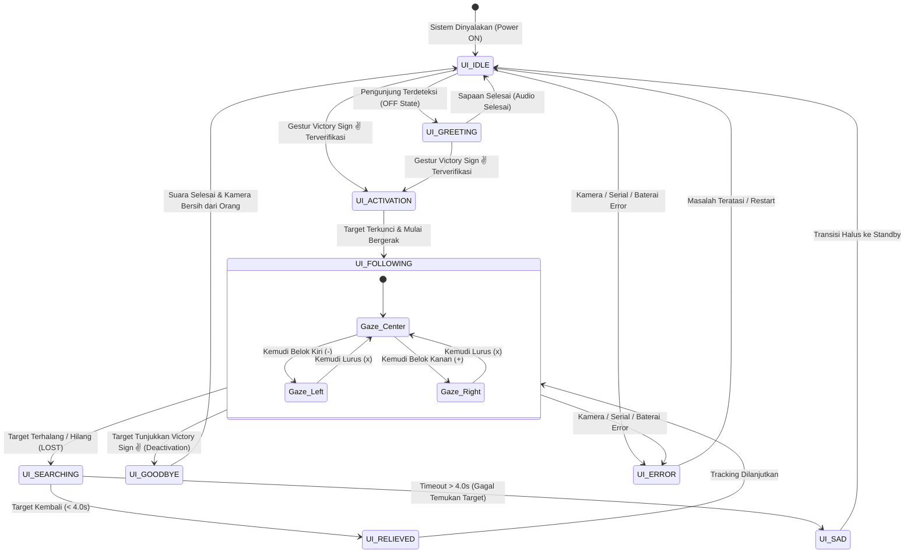

# Spesifikasi State Machine Layar & UI Emoji Robot NEXUS
=============================================================

**Dokumen Versi**: 1.0  
**Tanggal**: 2026-09-26  
**Lokasi File**: `docs/ui.md`  
**Referensi**: 
- `docs/2_system_design/state_machine.md` (Logika State Inti Robot)  
- `docs/display_and_greets/greet.md` (Sinkronisasi Dialog Suara JARVIS)  
- `docs/3_software_design/module_specification.md`  

---

## 1. Pendahuluan & Tujuan Desain

Dokumen ini mendefinisikan spesifikasi **Human-Machine Interface (HMI) Visual Layar** untuk Robot Pengikut Orang NEXUS. 

Layar robot (terpasang pada bagian kepala/dada robot) berfungsi menampilkan **animasi wajah emoji ekspresif** yang bereaksi secara *real-time* sesuai dengan kondisi (*state machine*) robot. Pendekatan ini bertujuan untuk:
1. **Meningkatkan Interaksi Emosional**: Memberikan kesan ramah, hidup (*lifelike*), cerdas, dan menyenangkan bagi civitas akademika dan pengunjung departemen.
2. **Indikator Status Intuitif**: Pengguna dapat langsung mengetahui apakah robot sedang standby, mengenali target, sedang mencari orang yang hilang, atau mengalami error hanya dengan melihat ekspresi wajahnya tanpa perlu membaca teks teknis.
3. **Sinkronisasi Audiovisual**: Setiap animasi ekspresi emoji selaras dengan dialog suara robot (*JARVIS voice greets*) dan gerakan manuver kemudi.

---

## 2. Tabel Pemetaan State Machine Layar & Emoji

Setiap kondisi robot memiliki representasi visual berupa klip video loop atau animasi ekspresi:

| No | State Robot | Nama State UI | Simbol Emoji | Ekspresi Wajah & Animasi Visual | Aset Video Rekomendasi | Suara Terkait |
| :---: | :--- | :--- | :---: | :--- | :--- | :--- |
| **1** | **OFF / STANDBY** | `UI_IDLE` | 😐 / 😴 | **Netral / Datar Santai**: Mata tenang terbuka santai, garis mulut datar/senyum tipis. Dilengkapi animasi kedipan mata santai (*periodic blink*) tiap 3–5 detik. | `face_neutral.mp4` | *(Hening)* |
| **2** | **GREETING** | `UI_GREETING` | 😊 / 😃 | **Senyum Ramah & Berbicara**: Mata melengkung ramah tersenyum (`^_^`), mulut bergerak berirama (*talking mouth*) mensimulasikan ucapan selamat datang. | `face_greeting.mp4` | **Startup Greeting**: *"Welcome to the Technology and Information Department..."* |
| **3** | **TARGET_LOCK** | `UI_ACTIVATION` | 🤩 / 😉 | **Gembira & Verifikasi Berhasil**: Mata berbinar gembira (`^o^`), kedipan sebelah mata (*friendly wink*), senyum lebar antusias menyambut target baru. | `face_excited.mp4` | **Activation**: *"Hello! Nice to see you."* |
| **4** | **FOLLOW (Lurus)** | `UI_FOLLOWING` | ☺️ / 👀 | **Fokus Ramah & Bergerak**: Mata menatap lurus ke depan dengan fokus, senyum ramah stabil, pupil sesekali melirik dinamis. | `face_follow_center.mp4` | **Following**: *"I'm right behind you."* *(tiap 45s)* |
| **5** | **FOLLOW (Belok)** | `UI_FOLLOW_TURN` | 😏 / 👉 | **Gaze Tracking (Melirik Arah Kemudi)**: Mata melirik ke arah kiri/kanan mengikuti perintah ESP32 (`-` belok kiri $\to$ mata lirik kiri, `+` belok kanan $\to$ mata lirik kanan). | `face_turn_left.mp4`<br>`face_turn_right.mp4` | *(Sesuai manuver)* |
| **6** | **TARGET_LOST** | `UI_SEARCHING` | 🤨 / 🧐 | **Bingung & Mencari**: Alis sedikit berkerut, mata celingak-celinguk menatap kiri-kanan mencari keberadaan orang (`O_o` / `?_?`), mulut membentuk huruf 'o' kecil cemas. | `face_searching.mp4` | **Target Lost**: *"Where are you?"* |
| **7** | **TARGET_REACQUIRED** | `UI_RELIEVED` | 🥳 / ✨ | **Lega & Ceria Kembali**: Mata berbinar cerah menyambut kembalinya target sebelum timeout, senyum bersinar seketika. | `face_reacquired.mp4` | **Target Reacquired**: *"Target locked. Ready to follow."* |
| **8** | **LOSS_TIMEOUT** | `UI_SAD` | 🥺 / 😞 | **Sedih / Kecewa Lembut**: Kelopak mata sayu tertunduk, sudut mulut melengkung ke bawah sejenak (`v_v`), sebelum perlahan transisi kembali ke netral (*standby*). | `face_timeout.mp4` | **Timeout**: *"I can't find you."* |
| **9** | **DEACTIVATION** | `UI_GOODBYE` | 👋 / 😌 | **Pamit Santun**: Mata tersenyum hangat, animasi kedipan ramah perpisahan, lalu ekspresi meredup tenang kembali ke mode standby. | `face_goodbye.mp4` | **Deactivation**: *"Okay! See you later!"* |
| **10** | **SYSTEM_ERROR** | `UI_ERROR` | 😵 / ⚠️ | **Pusing / Peringatan Bahaya**: Mata berbentuk silang (`X_X`) atau spiral pusing dengan aksen warna kuning/merah waspada. | `face_error.mp4` | **System Error**: *"Something went wrong."* |

---

## 3. Diagram State Machine Visual Layar

Diagram berikut mengilustrasikan alur transisi ekspresi wajah emoji di layar:



---

## 4. Rincian Karakteristik Visual & Perilaku Wajah

### 4.1. Gaya Visual Wajah (*Art Style*)
* **Cybernetic Digital Anime / Minimalist Robot Face**:
  * Desain berupa siluet mata dan mulut bercahaya (*glowing vector face*) dengan latar belakang gelap pekat (`#000000`).
  * Pilihan palet warna utama:
    * **Normal / Ramah**: Biru Keemasan / Cyan Neon (`#00E5FF` atau `#00A8FF`).
    * **Sukacita / Sukses**: Hijau Zamrud Neon (`#00E676`).
    * **Bingung / Mencari**: Kuning Oranye Cerah (`#FFB300`).
    * **Sedih / Timeout**: Biru Lavender Lembut (`#7986CB`).
    * **Error / Kritis**: Merah Darurat (`#FF1744`).

### 4.2. Perilaku Alami (*Natural Life-like Motion*)
* **Micro-Blinking (Kedipan Alami)**:
  * Pada state `UI_IDLE` dan `UI_FOLLOWING`, animasi mata secara berkala menutup rapat dan membuka kembali selama 150 ms (kedipan ganda sesekali) agar wajah robot tidak kaku seperti gambar mati.
* **Gaze Direction Following (Arah Pandang Kemudi)**:
  * Ketika controller kemudi mengirimkan perintah:
    * Perintah `-` (Belok Kiri): Pupil mata melirik ke sudut kiri layar.
    * Perintah `x` (Lurus): Pupil mata berada tepat di tengah.
    * Perintah `+` (Belok Kanan): Pupil mata melirik ke sudut kanan layar.

---

## 5. Spesifikasi Teknis Format Aset & Implementasi

### 5.1. Spesifikasi File Video Aset
* **Direktori Penyimpanan**: `assets/ui/face/`
* **Format Video**: MP4 (H.264 Video Codec) atau WebM (VP8/VP9 Codec).
* **Resolusi Target**:
  * $1024 \times 600$ piksel (Standar layar sentuh HDMI Raspberry Pi 7 inci).
  * $800 \times 480$ piksel (Alternatif layar sentuh 5 inci).
* **Frame Rate**: 30 FPS konstan.
* **Audio Track**: *None* (seluruh audio diproses secara independen oleh `SpeechManager`).
* **Looping**: Klip video dirancang *seamless loop* (sambungan frame akhir dan frame awal mulus tanpa lonjakan visual).

### 5.2. Opsi Engine Pemutar Video di Raspberry Pi
Untuk efisiensi komputasi agar tidak memotong FPS pendeteksi YOLO:
1. **Opsi A: OpenCV Frameless Window (`cv2.imshow` terpisah)**:
   * Membaca frame video dari memory buffer menggunakan thread terpisah.
2. **Opsi B: Pygame Display Surface**:
   * Ringan, akselerasi hardware frame buffer (`/dev/fb0`), memakan CPU < 5%.
3. **Opsi C: QML / PySide6 (Qt Quick Hardware Accelerated)**:
   * Menggunakan komponen `MediaPlayer` atau `VideoOutput` dengan akselerasi EGL/GLES Raspberry Pi.
4. **Opsi D: Lightweight Web Kiosk (Electron / Chromium Frameless)**:
   * Menampilkan animasi SVG/Lottie/Canvas via HTML5 video tag loop.

---

## 6. Sinkronisasi Antar-Komponen

Hubungan arsitektur antar modul pengendali utama, suara, dan tampilan layar:

```text
       ┌────────────────────────────────────────────────────────┐
       │             NEXUS CENTRAL TOP MODULE                   │
       │                 (top_module.py)                        │
       └───────┬───────────────────┬───────────────────┬────────┘
               │                   │                   │
      State Transition     Voice Triggers       Steering Data
               │                   │                   │
               ▼                   ▼                   ▼
     ┌──────────────────┐ ┌──────────────────┐ ┌──────────────────┐
     │ SCREEN UI ENGINE │ │  SPEECH MANAGER  │ │ ESP32 UART BRIDGE│
     │  (Face Display)  │ │ (JARVIS Audio)   │ │  (Motor Control) │
     │                  │ │                  │ │                  │
     │  - face_*.mp4    │ │  - greet_*.wav   │ │  - '-', 'x', '+' │
     │  - Visual Emoji  │ │  - Dialogue Play │ │  - Steering Sync │
     └──────────────────┘ └──────────────────┘ └──────────────────┘
```

1. **Event-Driven Switching**: Saat terjadi perubahan `NexusState` pada `StateMachine`, event diteruskan secara asinkron ke pemutar video layar untuk mengganti file video aktif tanpa jeda layar hitam (*seamless cross-fade* atau *instant swap*).
2. **Isolasi Thread**: Pemrosesan render video layar berjalan di thread terpisah dari pipeline deteksi kamera utama, sehingga FPS kamera dan pelacakan YOLO tetap optimal.

---

## 7. Kesimpulan

Dengan integrasi spesifikasi `docs/ui.md` ini, robot NEXUS memiliki kepribadian visual (*expressive robotics personality*) yang interaktif dan komunikatif. Wajah emoji di layar secara presisi mencerminkan apa yang sedang dipikirkan dan dilakukan oleh robot di setiap state operasionalnya.
